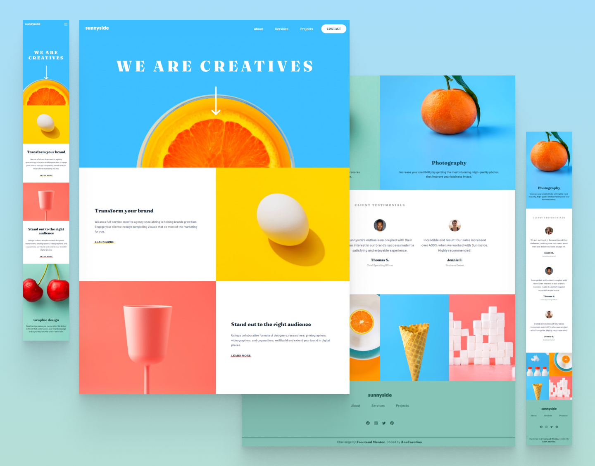

# Frontend Mentor - Solução landing page da agência Sunnyside

[English README](./README.md)

Esta é a solução para o [Desafio da landing page da agência Sunnyside do Frontend Mentor](https://www.frontendmentor.io/challenges/sunnyside-agency-landing-page-7yVs3B6ef). Desafios do Frontend Mentor ajudam a melhorar as habilidades de codificação por meio do desenvolvimento de projetos realistas.

## Tabela de conteúdos

- [Visão geral](#visão-geral)
  - [O desafio](#o-desafio)
  - [Screenshot](#screenshot)
  - [Links](#links)
- [Meu processo](#meu-processo)
  - [Desenvolvido com](#desenvolvido-com)
  - [O que aprendi](#o-que-aprendi)
  - [Desenvolvimento contínuo](#desenvolvimento-contínuo)
  - [Links úteis](#links-úteis)
- [Autora](#autora)

## Visão geral

### O desafio

O usuário deve ser capaz de:
- Ver o melhor layout dependendo do tamanho da tela de seu dispositivo.
- Ver os estados de foco (hover states) para todos os elementos interativos da página.

### Screenshot

<!--  -->


### Links

- URL da Solução: [https://github.com/AnaCarol2001/SunnysideAgencyLandingPage](https://github.com/AnaCarol2001/SunnysideAgencyLandingPage)
- URL Site: [https://anacarol2001.github.io/SunnysideAgencyLandingPage/#](https://anacarol2001.github.io/SunnysideAgencyLandingPage/#)

## Meu processo

### Desenvolvido com

- Marcação HTML5 semântica
- Propriedades personalizadas CSS
- Flexbox
- CSS Grid
- Mobile-first workflow
- Metodologia BEM


### O que aprendi

Neste projeto, meu objetivo principal era aplicar conceitos básicos para fortalecer meus fundamentos de HTML e CSS. Para me desafiar, aprendi sobre uma das metodologias de CSS chamada BEM, utilizada para nomear elementos HTML e organizar o arquivo CSS.

```css
/*BEM*/
.block{}
.block__element{}
.block--modifier{}
```

### Desenvolvimento contínuo

Enquanto desenvolvia este projeto, notei que deveria aprender mais sobre acessibilidade Web, dessa forma, dedicarei meus estudos e projetos futuros para desenvolver aplicações mais acessíveis. Além do mais, descobrir sobre a metodologia BEM foi incrível, uma vez que é mais fácil nomear os elementos HTML com base nesse método e melhor estruturar os estilos CSS, logo continuarei utilizando. 

### Links úteis

- [Why I use the BEM naming convention for my CSS](https://youtu.be/SLjHSVwXYq4?si=OCKEiEbcyhHxPUN4) - Esse canal é excelente para quem quer aprender sobre CSS e estar sempre atualizado de suas novidades.
- [BEM](https://getbem.com/introduction/) - Documentação BEM.
- [Como fazer um triângulo com CSS](https://medium.com/horadecodar/como-fazer-um-tri%C3%A2ngulo-com-css-8621d57f4d35) - Este artigo me ajudou a entender como fazer um triângulo usando apenas CSS.


## Autora
- Frontend Mentor - [@AnaCarolina](https://www.frontendmentor.io/profile/AnaCarol2001)

